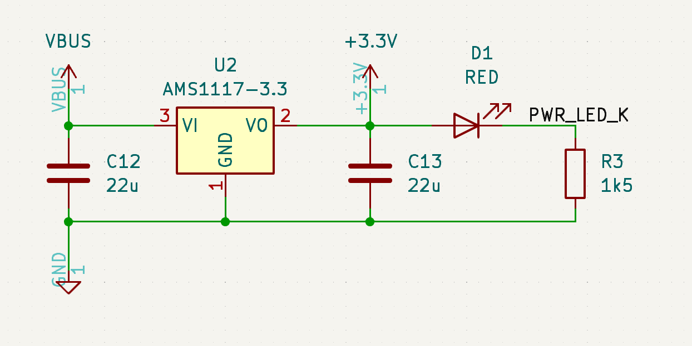
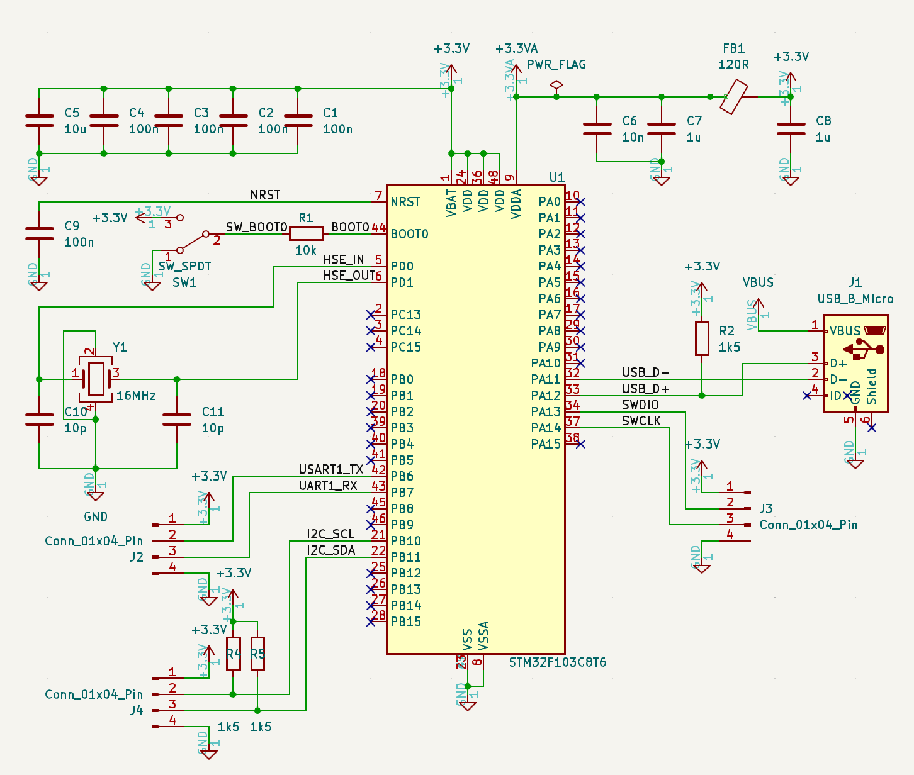
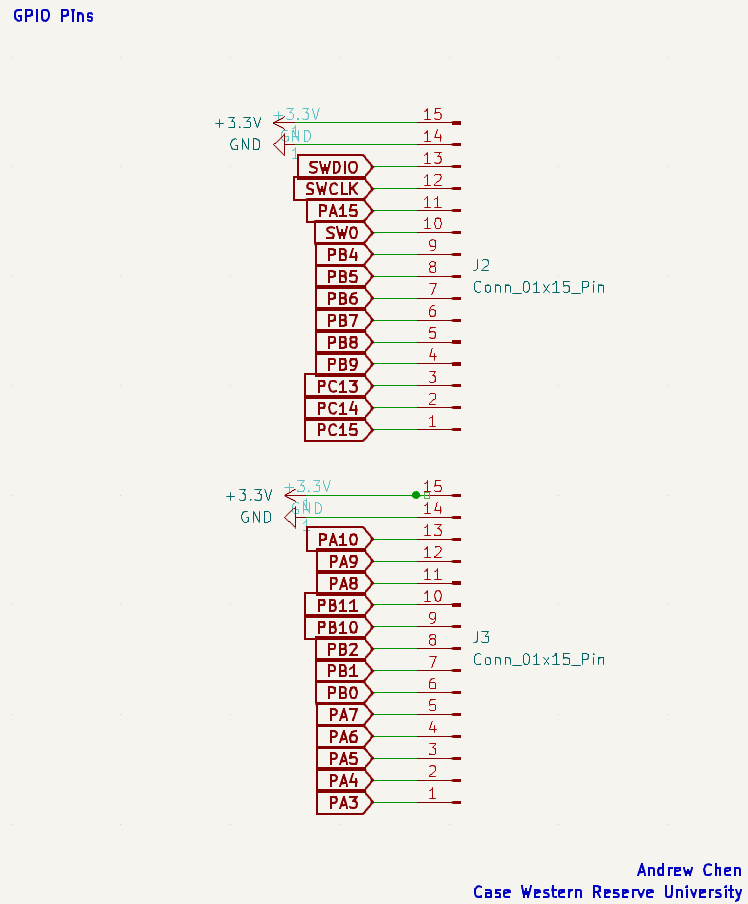

# STM32 MCU Board

## Introduction
This repository is my first ever PCB design project. After working on projects that involved more digital circuits and RTL scripting, I've always wanted to build my own boards, more specifically FPGA boards. However, I want to start on something simpler so I can understand the inner workings of PCB design, decision choices, and general concepts that are crucial to a functional STM32 board.

## Design Approach
Given that this is just a basic guide to designing, laying out, and manufacturing a simple STM32 board, this PCB will only offer a single USB interface, an I2c interface, and a UART interface. The specific processor chip that we are using is the STM32F103C8Tx, which uses an `ARM Cortex-M3 processor`. 

### Power Regulator Circuit

    

    <em> LDO-Based Power Regulator Circuit.</em>

Here we have the external USB-B micro port that interfaces with our STM32 microcontroller. In order to use `VBUS` coming from this port, I stepped down any input voltage down to 3.3V using the **AMS1117** chip, which requires two `22uF` capacitors according to its datasheet, one at the input and one at the output. At the output, the 3.3V signal is then passed through an LED with a current limiting resistor as a visual indicator that the 3.3V source is present at the output.

 
Quick note about the shield option being ignored, generally the shield pin is to connect the board to an external chassis but because this is a standalone board, that's why it's ignored.

### STM32F103C8T6 MCU

    

    <em>MCU Schematic with USB-B Micro Interface.</em>

First and foremost, there needs to be capacitors between the 3.3V source and ground. Since this specific STM32 microcontroller has 4 **VDD** pins, there must generally be a `100 nF` capacitor in parallel for each of these pins. These capacitors act as `decoupling capacitors`, ensuring a steady voltage supply to each VDD pin. In addition, a bulk capacitor with a value of `4.7 uF` is also placed in parallel to the decoupling capacitors to handle lower-frequency current swings, while the decoupling capacitors handle the higher frequency noise and transients.

## Connectors

  

Here, the pins are just given an external interface so that later we will be able to program the board using the STM32Cube IDE to interact with the STM32 PCB.

## Assigning Footprints

## PCB Layout

## 3D View

## Physical Board / Functionality
---
