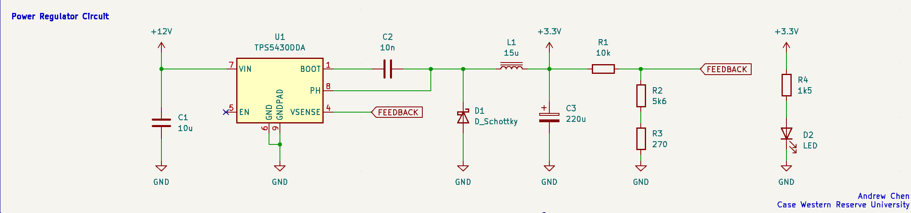

# STM32 Development Board

## Introduction
This repository is my first ever PCB design project. After working on projects that involved more digital circuits and RTL scripting, I've always wanted to build my own boards, more specifically FPGA boards. However, I want to start on something simpler so I can understand the inner workings of PCB design, decision choices, and general concepts that are crucial to a functional STM32 board.

## Design Approach
Given that this is just a basic guide to designing, laying out, and maunfacturing a simple STM32 board, this PCB will only offer 2 UART channelgs and a single I2C bus for peripherals. 

### Power Regulator Circuit

    
     
    <figcaption align="center"><em>Buck Converter Based Power Regulator Circuit.</em></figcaption>

### STM32F030 MCU

  

## Connectors

### Left Connector

  

### Right Connector

  

---

Please check each subdirectory for more detail.
