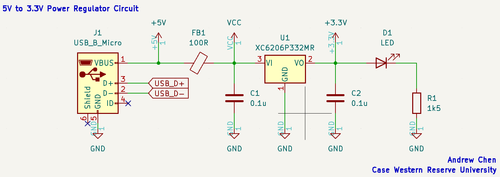

# STM32 MCU Board

## Introduction
This repository is my first ever PCB design project. After working on projects that involved more digital circuits and RTL scripting, I've always wanted to build my own boards, more specifically FPGA boards. However, I want to start on something simpler so I can understand the inner workings of PCB design, decision choices, and general concepts that are crucial to a functional STM32 board.

## Design Approach
Given that this is just a basic guide to designing, laying out, and manufacturing a simple STM32 board, this PCB will only offer a single USB interface. The specific processor chip that we are using is the STM32F103C8Tx, which uses an `ARM Cortex-M3 processor`. 

### Power Regulator Circuit

    

    <em> LDO-Based Power Regulator Circuit.</em>

### STM32F030 MCU

    

    <em>MCU Schematic with USB-B Micro Interface.</em>

## Connectors

  

## Assigning Footprints

## PCB Layout

## 3D View

## Physical Board / Functionality
---
