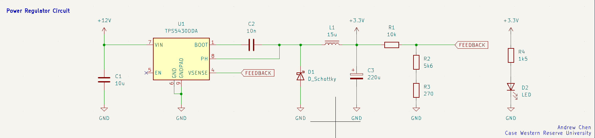
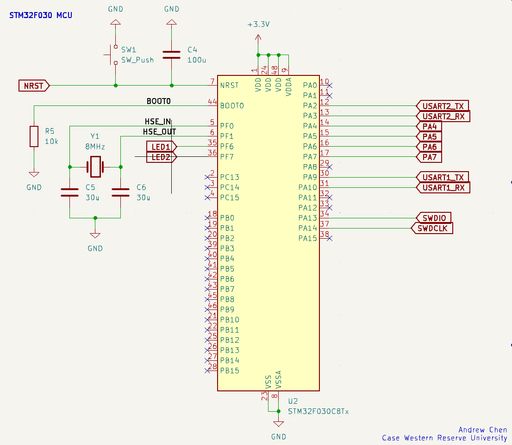
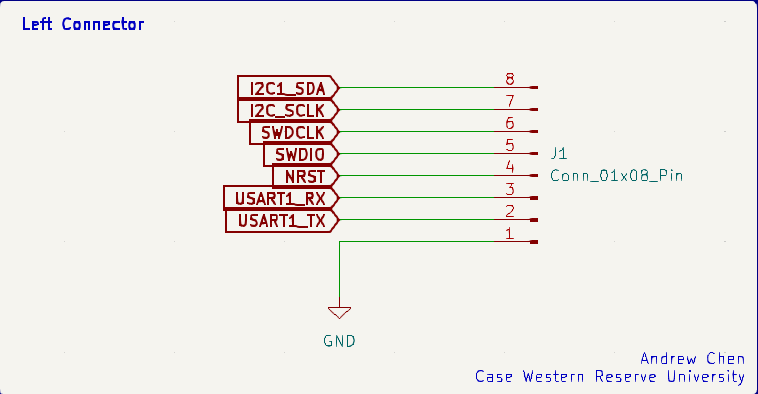
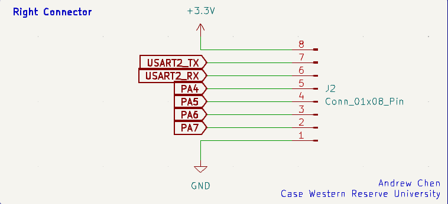

# STM32 MCU Board

## Introduction
This repository is my first ever PCB design project. After working on projects that involved more digital circuits and RTL scripting, I've always wanted to build my own boards, more specifically FPGA boards. However, I want to start on something simpler so I can understand the inner workings of PCB design, decision choices, and general concepts that are crucial to a functional STM32 board.

## Design Approach
Given that this is just a basic guide to designing, laying out, and manufacturing a simple STM32 board, this PCB will only offer 2 UART channels and a single I2C bus for peripherals. 

### Power Regulator Circuit

    

    <em>Buck Converter Based Power Regulator Circuit.</em>

For the specific buck converter that we are using, I'm using the TPS54300DDA chip. 

### STM32F030 MCU

  

    <em>MCU Schematic with GPIO, UART, and I2C pins.</em>

## Connectors

### Left Connector

  

    <em>External connector for I2C bus, NRST, and USART1 pins.</em>

### Right Connector

  

    <em>External connector for USART2 and GPIO pins.</em>

## Assigning Footprints

## PCB Layout

## 3D View

## Physical Board / Functionality
---

Please check each subdirectory for more detail.
