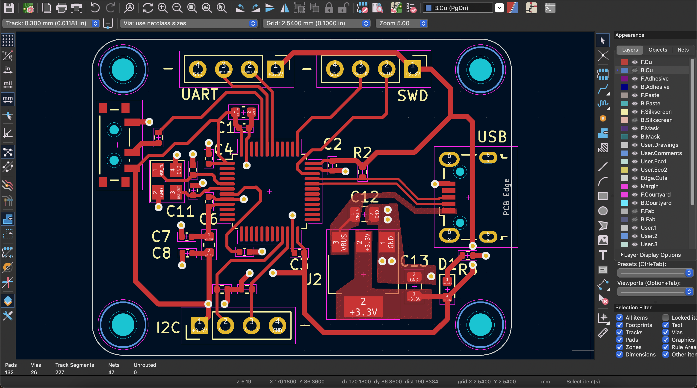
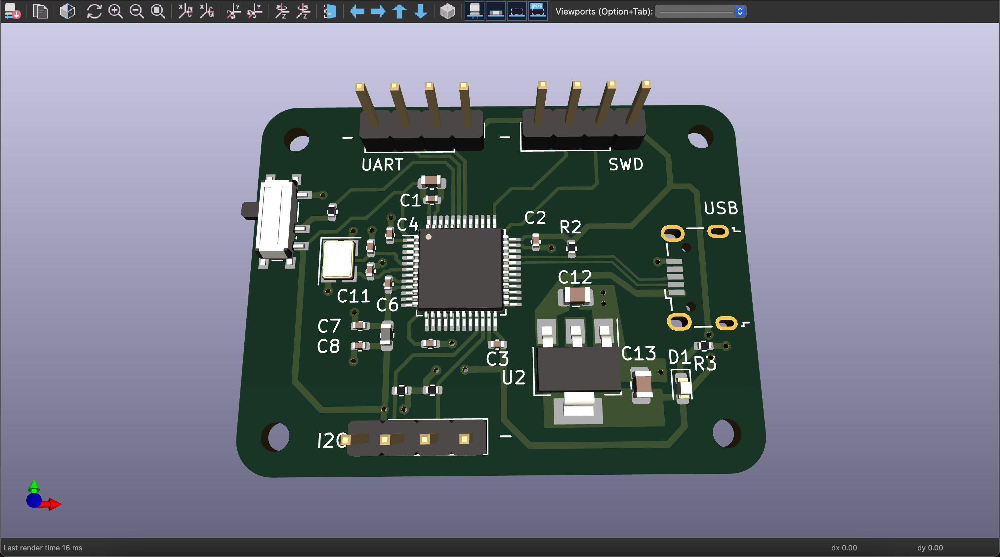

# STM32 MCU Board

## Introduction
This repository is my first ever PCB design project. After working on projects that involved more digital circuits and RTL scripting, I've always wanted to build my own boards, specifically FPGA boards. However, I want to start on something simpler so I can understand the inner workings of PCB design, decision choices, and general concepts that are crucial to a functional STM32 board.

## Design Approach
Given that this is just a basic guide to designing, laying out, and manufacturing a simple STM32 board, this PCB will only offer a single USB port, an I2C interface, an SWD interface, and a UART interface. The specific processor chip that we are using is the STM32F103C8Tx, which uses an `ARM Cortex-M3 processor`. 

### Power Regulator Circuit
<p align="center">
    
</p>
<p align="center">
    <em> LDO-Based Power Regulator Circuit.</em>
</p>

Here we have the external USB-B micro port that interfaces with our STM32 microcontroller. In order to use `VBUS` coming from this port, I stepped down any input voltage down to 3.3V using the **AMS1117** chip, which requires two `22uF` capacitors according to its datasheet, one at the input and one at the output. At the output, the 3.3V signal is then passed through an LED with a current limiting resistor as a visual indicator that the 3.3V source is present at the output.

<br />
Quick note about the shield option being ignored, generally the shield pin is to connect the board to an external chassis but because this is a standalone board, that's why it's ignored.

### STM32F103C8T6 MCU
<p align="center">
    
</p>
<p align="center">
    <em>MCU Schematic with USB-B Micro Interface.</em>
</p>

First and foremost, there needs to be capacitors between the 3.3V source and ground. Since this specific STM32 microcontroller has 4 **VDD** pins, there must generally be a `100 nF` capacitor in parallel for each of these pins. These capacitors act as `decoupling capacitors`, ensuring a steady voltage supply to each VDD pin. In addition, a bulk capacitor with a value of `4.7 uF` is also placed in parallel to the decoupling capacitors to handle lower-frequency current swings, while the decoupling capacitors handle the higher frequency noise and transients.

## PCB Layout

<p align="center">
    
</p>
<p align="center">
    <em> Signal traces on the STM32 board, with power traces being 0.5mm while ordinary traces are kept at 0.3mm. Vias are used for ground traces. </em>
</p>

In general, vias are used to link ground pins to the ground plane. Most signals are routed on the top copper layer, with a couple of vias used to prevent signal crossing especially with the 3.3V bus. 
A copper pour was used near the voltage regulator to create ground and power planes whilst also reducing EMI and improving signal integrity.

Quick note: to further increase the stability of a 2-layer board like this, it is recommended to add as much stitching vias as possible, on top of adding a ground pour on the top layer. This is to decrease
the distance that sensitive signals have to travel to get to ground, reducing the inductance and therefore maximizing signal integrity.

## 3D View

<p align="center">
    
</p>
<p align="center">
    <em> Front copper layer with all signal traces and silkscreens. </em>
</p>


## Physical Board / Functionality

After passing a design rule check on KiCAD, it's time to send the files to a PCB manufacturer to get my board assembled. For this specific board, I'm using `JLCPCB`'s services to get my board manufactured. 

<p align="center">
    
</p>
<p align="center">
    <em>Manufactured Board from JLCPCB.</em>
</p>

Unfortunately, I was unable to find the USB micro-B ports for these boards, but I still want to be able to program it using an ST-Linker that I found off of Amazon for roughly `$9`. 

To test the UART interface of this STM32 board, I'll write a simple UART transceiver on my Basys3 FPGA board to interface with it.

UART Receiver:
```VHDL
library IEEE;
use IEEE.STD_LOGIC_1164.ALL;
use IEEE.NUMERIC_STD.ALL;

entity uart_rx is
    generic (
        clk_ticks: integer := 54 -- taken from (100_000_000 / 115200) / 16 = 54.25 ticks
        );
    port ( 
        clk : in STD_LOGIC;
        rst : in STD_LOGIC;
        rx : in STD_LOGIC;
        data : out STD_LOGIC_VECTOR (7 downto 0)
        );
end uart_rx;

architecture Behavioral of uart_rx is
    -- define internal signals here
    type rx_state is (IDLE, START, DATA, STOP); -- defined states
    signal curr_state : rx_state := IDLE; -- initial state
    
    signal baud_clk : STD_LOGIC := '0';
    signal data_i : STD_LOGIC_VECTOR(7 downto 0) := (others => '0');
    
begin
    -- define internal processes here
    
    -- first process is a clock generator that generates an oversampled
    -- clock signal to check for the rx signal
    clk_generator : process(clk) 
        variable clk_count : integer range 0 to clk_ticks := 0;
    begin 
        if rst = '1' then
            clk_count := 0;
            baud_clk <= '0';
        elsif rising_edge(clk) then
            if clk_count = clk_ticks then
                clk_count := 0;
                baud_clk <= '1'; -- set high when clk count reaches 54
            else
                clk_count := clk_count + 1;
                baud_clk <= '0';
            end if;
        end if;
    end process;
    
    -- second process handles the state machine logic
    rx_FSM : process(clk) 
        variable bit_count : integer range 0 to 7 := 0; -- check for where we are in the data word
        variable bit_duration : integer range 0 to 15 := 0; -- check if a logic level has stayed steady
    begin
        if rst = '1' then
            data_i <= (others => '0'); -- reset data bus
            curr_state <= IDLE;
            bit_count := 0;
            bit_duration := 0;
        elsif rising_edge(clk) then
            if baud_clk = '1' then
                case curr_state is
                    when IDLE =>
                        data_i <= (others => '0');
                        bit_count := 0;
                        bit_duration := 0;
                        -- if the rx line gets pulled low then
                        if rx = '0' then
                            curr_state <= START;
                        end if;
                    when START =>
                        if rx = '0' then
                            if bit_duration = 7 then
                                curr_state <= DATA;
                                bit_duration := 0;
                            else
                                bit_duration := bit_duration + 1;
                            end if;
                        else
                            curr_state <= IDLE;
                        end if;
                    when DATA =>
                        if (bit_duration = 15) then                
                                data_i(bit_count) <= rx;     
                                bit_duration := 0;
                                if (bit_count = 7) then -- we got 8 bits             
                                    curr_state <= STOP;
                                    bit_duration := 0;
                                else
                                    bit_count := bit_count + 1;
                                end if;
                            else
                                bit_duration := bit_duration + 1;
                            end if;
                    when STOP =>
                        if (bit_duration = 15) then      
                                data <= data_i;    
                                curr_state <= IDLE;
                            else
                                bit_duration := bit_duration + 1;
                            end if;
                        when others =>
                            curr_state <= IDLE;
                end case;
            end if;
        end if;
    end process;

end Behavioral;

```

---
